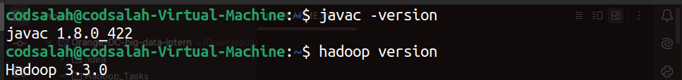
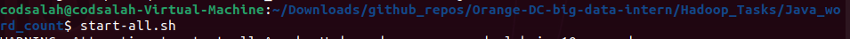
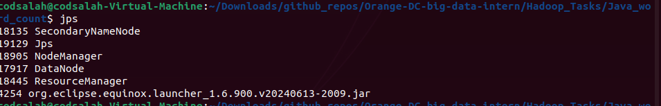
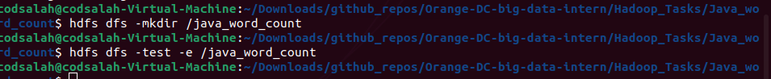
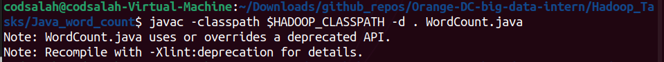
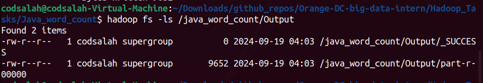
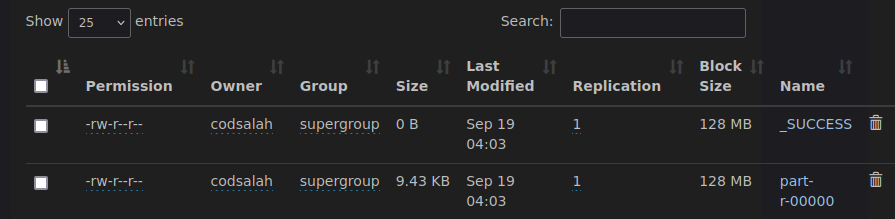
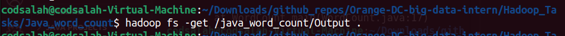
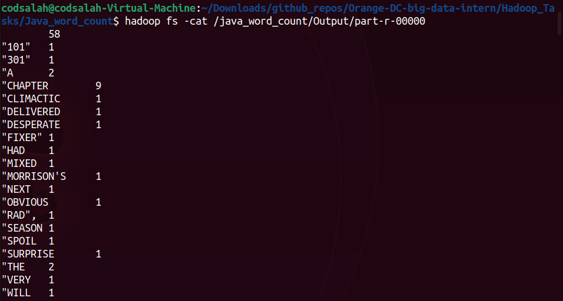

## Overview

This document describes the process for running a Hadoop MapReduce job to perform a word count operation and how to handle the output.
## Steps

- Check installation of Java and Hadoop

- Running Hadoop

- Check daemons

- Make HDFS directory and double-check it (CLI and UI)

- Specify location of classes that the compiler needs

- Double-check the output file (CLI and UI)

- Get the output on local machine

- Open the output file

## Notes

- Ensure that you have the appropriate permissions and configurations for HDFS and Git operations.
- Always double-check the paths and commands before execution to avoid mistakes.
