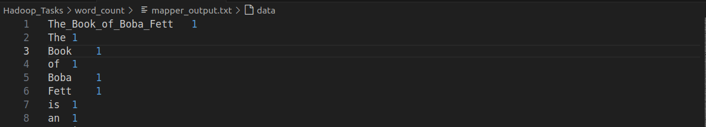
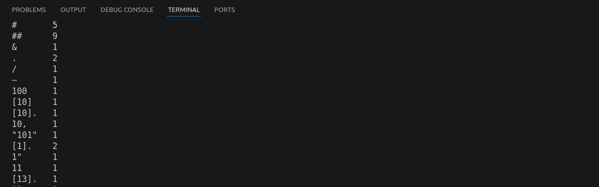

Word Count: Count the occurrence of all the words in an input text file.

To run the script on a file make sure you have the file on the same dir

1. **Run the mapper and save output:**
   ```bash
   cat ./Hadoop_Tasks/word_count/The_Book_of_Boba_Fett.txt | python3 ./Hadoop_Tasks/word_count/mapper.py > ./Hadoop_Tasks/word_count/mapper_output.txt
   ```

2. **Sort the mapper output:**
   ```bash
   cat ./Hadoop_Tasks/word_count/outputs/sorted_mapper_output.txt | python3 ./Hadoop_Tasks/word_count/reducer.py > ./Hadoop_Tasks/word_count/outputs/reducer_output.txt
   ```

3. **Run the reducer and save output:**
   ```bash
   cat ./Hadoop_Tasks/word_count/outputs/sorted_mapper_output.txt | python3 ./Hadoop_Tasks/word_count/reducer.py > ./Hadoop_Tasks/word_count/outputs/mapper_output.txt
   ```

4. **View the final output:**
   ```bash
   cat ./Hadoop_Tasks/word_count/mapper_output.txt
   ```
sample of mapper output


sample of final output

