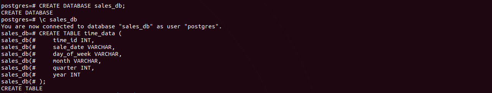
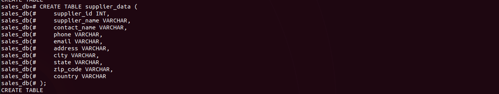
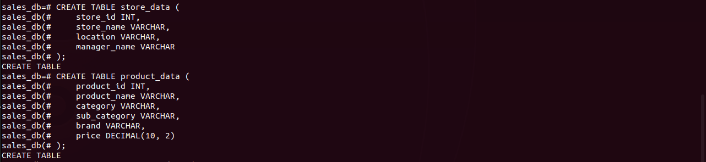
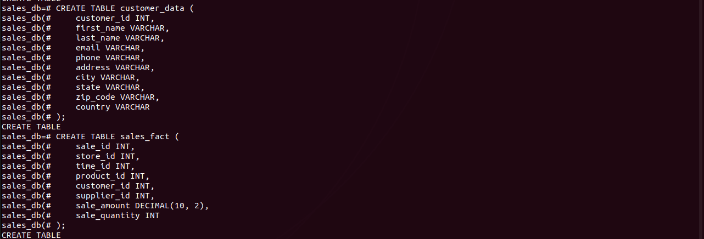
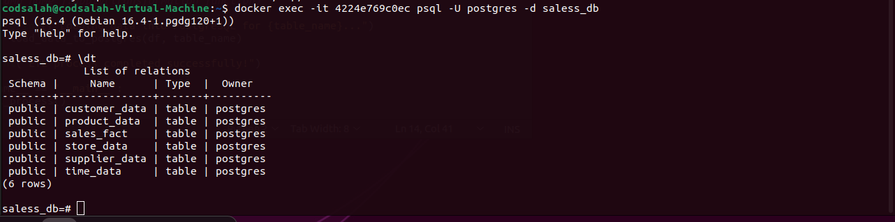
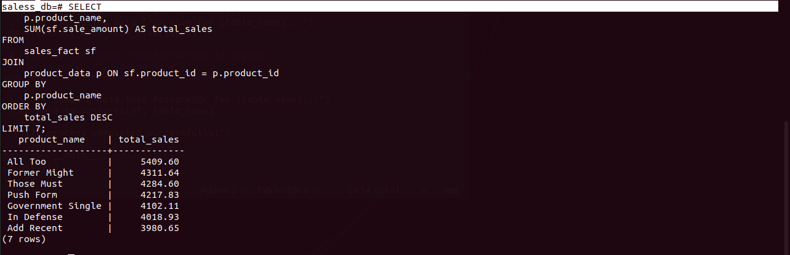
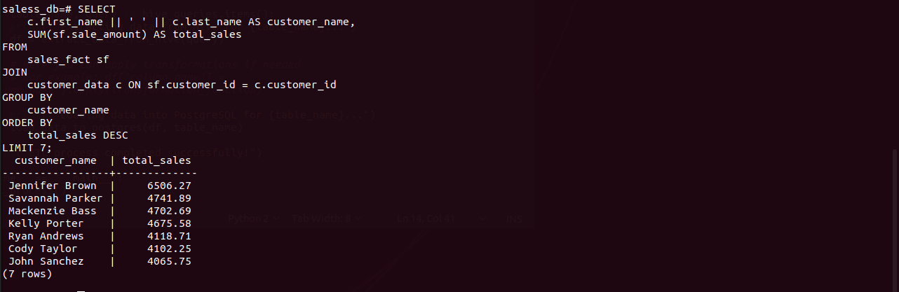
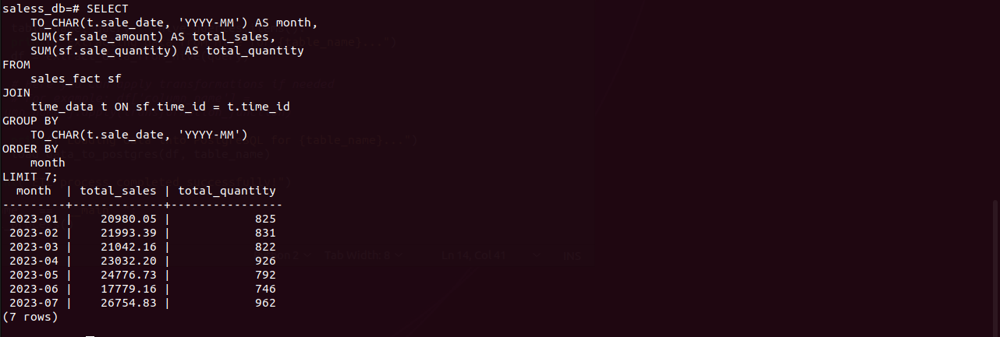
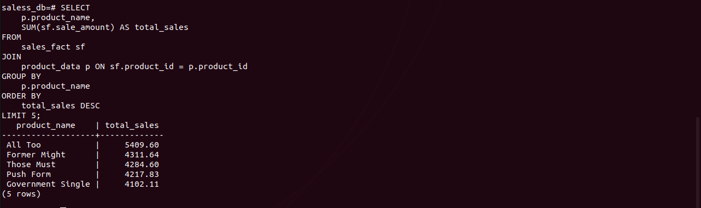
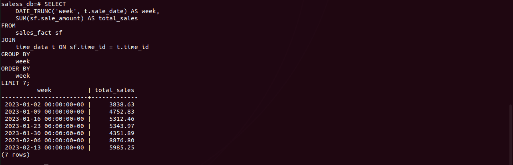

# Sales Data Warehouse with Hive and Postgres

This project sets up a Sales Data Warehouse using Apache Hive and PostgreSQL.

 The data warehouse is designed to manage, analyze, and report sales data, leveraging both Hive for data warehousing and Postgres as the metastore backend. The setup is done using Docker containers.

## Project Overview

The project is focused on creating a robust data warehouse for managing sales data. The environment consists of multiple services like:
- **Hive Metastore**
- **Hive Server**
- **PostgreSQL Metastore Database**
- **Hadoop NameNode**
- **Hadoop DataNode**
- **Presto (for interactive queries)**

## Project Components

### 1. Docker Compose Services

The project uses Docker Compose to orchestrate the following services:

- **Namenode**: Handles the metadata of HDFS (Hadoop Distributed File System).
- **Datanode**: Stores the actual data in HDFS.
- **Hive Metastore**: Manages the metadata for the Hive tables using PostgreSQL.
- **Hive Server**: Provides a service to execute Hive queries.
- **PostgreSQL**: Used as the backend database for Hive Metastore.
- **Presto Coordinator**: Executes queries interactively across distributed data sources.

### 2. Environment Setup

To set up the environment, run the following command:

```bash
docker-compose up
```

This will spin up all the necessary services including Hive, Postgres, Hadoop, and Presto.

## Sample Commands

### View Available Databases
To list the databases available in Hive, enter the Hive shell:

```bash
docker exec -it <hive-server-container-id> /bin/bash
hive
```

Then, run the following command in the Hive shell:

```sql
SHOW DATABASES;
```


## Create a Sales Data Model
You can create your sales data model by defining Hive tables in the appropriate database. 

The central table will be the `sales_fact` table, which links to dimension tables: `store_dim`, `time_dim`, `supplier_dim`, `product_dim`, and `customer_dim`.

### Star Schema
1. **Fact Table:** `sales_fact`
2. **Dimension Tables:** `store_dim`, `time_dim`, `supplier_dim`, `product_dim`, `customer_dim`


---
## Creating the DWH schema

### 1. `sales_fact` Table (Fact Table)
This table stores transactional data and foreign keys to dimension tables.

### 1. Create the Database

```sql
CREATE DATABASE sales_db;
USE sales_db;
```

### Updated Hive Code

#### 1. Create Time Dimension Table

```sql
CREATE TABLE time_data (
    time_id INT,
    sale_date STRING, -- Renamed from date Noooote
    day_of_week STRING,
    month STRING,
    quarter INT,
    year INT
)
ROW FORMAT DELIMITED
FIELDS TERMINATED BY ','
STORED AS TEXTFILE;
```

#### 2. Create Supplier Dimension Table

```sql
CREATE TABLE supplier_data (
    supplier_id INT,
    supplier_name STRING,
    contact_name STRING,
    phone STRING,
    email STRING,
    address STRING,
    city STRING,
    state STRING,
    zip_code STRING,
    country STRING
)
ROW FORMAT DELIMITED
FIELDS TERMINATED BY ','
STORED AS TEXTFILE;
```

#### 3. Create Store Dimension Table

```sql
CREATE TABLE store_data (
    store_id INT,
    store_name STRING,
    location STRING,
    manager_name STRING
)
ROW FORMAT DELIMITED
FIELDS TERMINATED BY ','
STORED AS TEXTFILE;
```

#### 4. Create Product Dimension Table

```sql
CREATE TABLE product_data (
    product_id INT,
    product_name STRING,
    category STRING,
    sub_category STRING,
    brand STRING,
    price DECIMAL(10,2),
    supplier_id INT  -- FK to supplier_data
)
ROW FORMAT DELIMITED
FIELDS TERMINATED BY ','
STORED AS TEXTFILE;
```

#### 5. Create Customer Dimension Table

```sql
CREATE TABLE customer_data (
    customer_id INT,
    first_name STRING,
    last_name STRING,
    email STRING,
    phone STRING,
    address STRING,
    city STRING,
    state STRING,
    zip_code STRING,
    country STRING
)
ROW FORMAT DELIMITED
FIELDS TERMINATED BY ','
STORED AS TEXTFILE;
```

#### 6. Create Sales Fact Table

```sql
CREATE TABLE sales_fact (
    sale_id INT,
    store_id INT,
    time_id INT,
    product_id INT,
    customer_id INT,
    supplier_id INT,  -- FK to supplier_data
    sale_amount DECIMAL(10,2),
    sale_quantity INT
)
ROW FORMAT DELIMITED
FIELDS TERMINATED BY ','
STORED AS TEXTFILE;
```


```sql
SHOW TABLES;
```


Now we put the data from the local machine to the container then to  the hdfs
 

copy the data to hdfs
 

load data


show head data of product data 
 

# Hive to Postgres
Use the PostgreSQL shell to create the same schema to pull the database into it.











(i had to drop some columns and come up with the `saless_db` as the final postgres schema)

## Useful Queries in PostgreSQL Shell

1. **Total Sales by Product**
   

2. **Sales by Customer**
   

3. **Monthly Sales Overview**
   

4. **Top 5 Products by Sales**
   

5. **Total Sales for Each Week**
   Visualize how sales performance fluctuates week by week.
   

