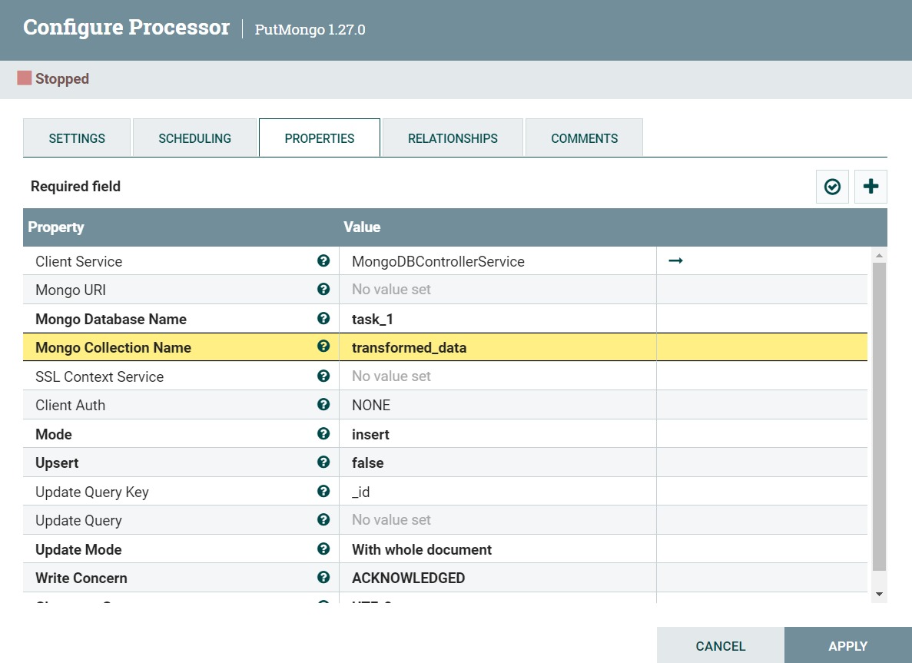

# NiFi to MongoDB Data Flow

This project demonstrates a simple data flow from MongoDB, applying a JOLT transformation, and then writing the modified data back to MongoDB.

## Project Overview

**Objective:**  
Retrieve data from MongoDB, modify the `price` field using a JOLT transformation, and write the updated data back to MongoDB.
### Original Data


## Steps


### 1. GetMongo Configuration


**Processor:** `GetMongo`  
**Description:** Retrieves data from the MongoDB collection.

- **Client Service:** `MongoDBControllerService` Handles the MongoDB connection details
- **Mongo Database Name:** `task_1` Name of the MongoDB database
- **Mongo Collection Name:** `original_data` Collection from which to retrieve documents
- **Client Auth:** `NONE` No authentication required for MongoDB connection
- **JSON Type:** `Extended JSON` Data format returned by MongoDB queries
- **Pretty Print Results JSON:** `True` Makes the output JSON easier to read
- **Character Set:** `UTF-8` Ensures data is encoded using UTF-8 standard
- **Query:** `{}` Retrieve all documents or apply a filter as needed.


### 2. JOLTTransformation Configuration

**Processor:** `JOLTTransformation`  
**Description:** Transforms the data using a JOLT spec to modify the `price` field.


- **Jolt Transformation DSL:** `Modify - Overwrite`  <!-- Overwrites existing values in the document -->
- **Jolt Specification:**  
  ```json
  {
    "price": "=intSum(@(1,price), 2)"
  }
  ```  
 Adds 2 to the existing price value 
- **Transform Cache Size:** `1`   Number of cached transform results 
- **Pretty Print:** `false`   Keeps the JSON output compact 
- **Max String Length:** `20 MB`  Maximum size allowed for transformed strings 


### 3. PutMongo Configuration


**Processor:** `PutMongo`  
**Description:** Inserts or updates the transformed data into the MongoDB collection.

- **Mongo Database Name:** `task_1`   Name of the MongoDB database where data will be inserted 
- **Mongo Collection Name:** `transformed_data`   Collection to store the transformed documents 
- **SSL Context Service:** `No value set` No SSL configuration for this connection 
- **Client Auth:** `NONE`   No authentication required for MongoDB connection 
- **Upsert:** `insert`  Inserts new documents into the collection 
- **Update Query Key:** `_id`   Uses the `_id` field as the unique identifier for updates





## Transformed Data
