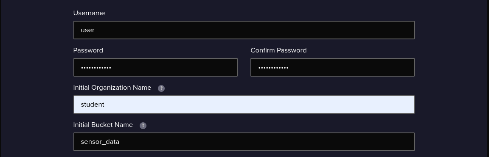

# Project: Time-Series Data Analytics for Predictive Maintenance

## Overview
This project focuses on storing time-series data in an InfluxDB bucket and applying visualizations on the data using Grafana. 

The goal is to analyze sensor data for predictive maintenance.

## Setup

### 1. Docker Compose Configuration
- Created a `docker-compose.yml` file to set up InfluxDB and Grafana in the same Docker network.

### 2. Create InfluxDB Database
- Executed commands to create a bucket in InfluxDB named `The_Sensors`.

```bash
docker exec -it influxdb influx -execute "CREATE BUCKET The_Sensors"
```



### 3. Ingest Time-Series Data
- Inserted time-series sensor data into the `The_Sensors` bucket in InfluxDB.

 Here's a sample of how to insert data:

```bash
curl -i -X POST http://localhost:8086/write?bucket=The_Sensors&precision=s \
  --data-binary 'airSensors,sensor_id=TLM0100 co=0.4923936554728619 1664625512'
```

### 4. Connect Grafana to InfluxDB
- Opened Grafana at `http://localhost:3000` and logged in.
- Added InfluxDB as a data source with the following configuration:
  - **HTTP URL:** `http://influxdb:8086`
  - **Database:** `The_Sensors`
  - **User:** (added the username)
  - **Password:** (added my super secret password)

### 5. Insights Created in Grafana

#### Insight 1: To retrieve the last 50 entries from the Sensors table


#### Insight 2: To retrieve the Avg value grouped by time


## Conclusion
The setup successfully connects InfluxDB to Grafana, allowing for the visualization of time-series data stored in the database.

 The insights provide valuable information regarding sensor performance and trends in the data.
