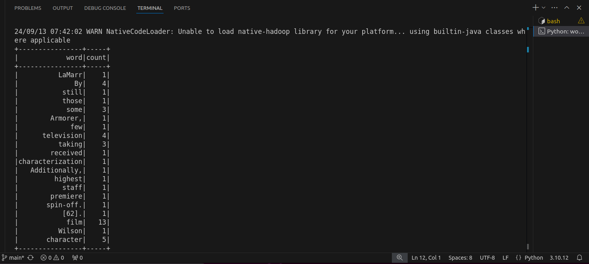

# PySpark Word Count
## Overview

This Task demonstrates how to perform a word count using Apache Spark with PySpark, Return result in tabular format.

## Files

- `wordCount.py`: The main Python script for performing the word count.
- `The_Book_of_Boba_Fett.txt`: The input text file for word count.
- `output/`: Directory where the word count results are saved.
- `imgs/output.png`: A screenshot of the results.

## Setup

### Prerequisites

- Apache Spark
- PySpark
- Python 3.x


**Run the Script**:

   ```sh
   python3 wordCount.py
   ```
### Result 
**View Results**: The word count results will be saved in the `output/` directory. 

A screenshot of the word count output is provided below:

