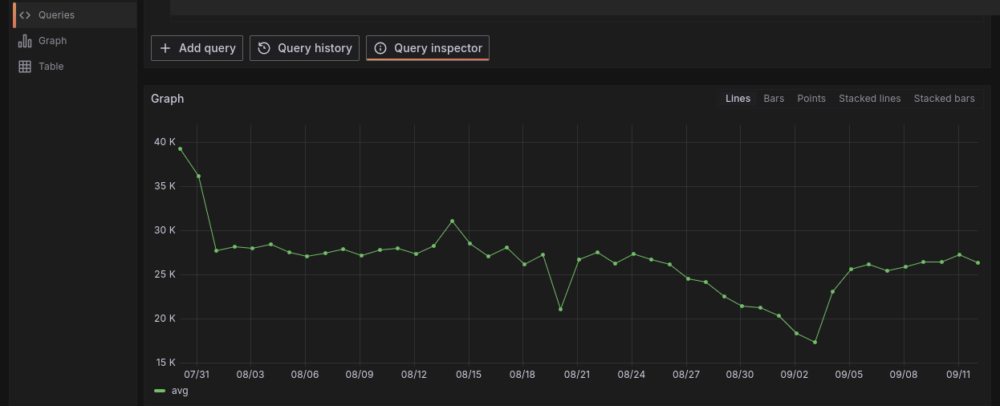
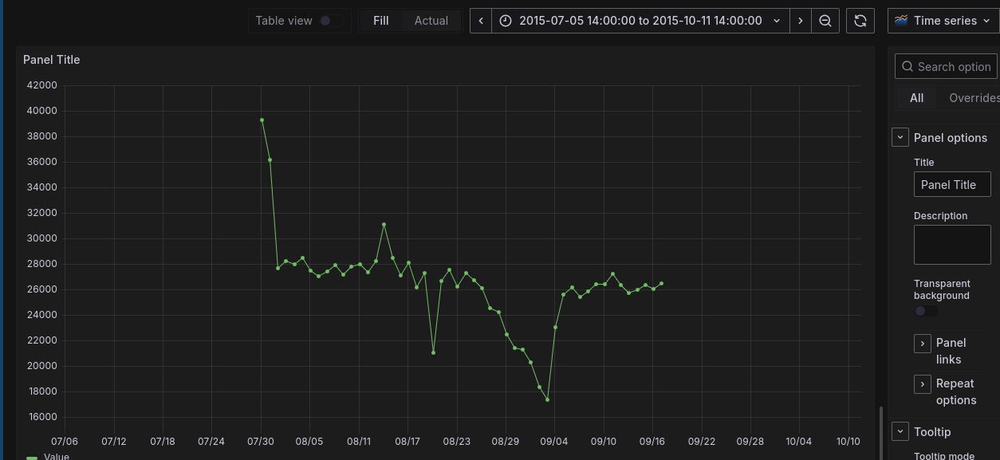

# Predictive Maintenance for Manufacturing Equipment

## Objective
This project focuses on predictive maintenance for manufacturing equipment, leveraging time-series data such as vibration and temperature to predict equipment failures. 

Real-time sensor data is processed using Spark, and historical data is stored in PostgreSQL. Finally, the job is monitored for optimization.

## Steps

1. **Dataset Selection**
   - Choose a dataset containing time-series data relevant to manufacturing equipment 
   - Ensure the dataset is available for ingestion into the Spark Streaming pipeline.


2. **Ingest and Process Data Using Spark Streaming**
   - Set up a Spark Streaming job to ingest real-time sensor data.
   - Process the data for necessary transformations (e.g., filtering, aggregating).


  


3. **Store Processed Data in PostgreSQL**
   - Create a PostgreSQL database and schema to store historical data.
   - Use JDBC to connect Spark to the PostgreSQL database.
   - Write the processed data from Spark to PostgreSQL.


4. **Connecting Postgres and Grafana using docker network**


- **Getting Average of Values in each day (the query)**
```sql
SELECT 
    "Date(UTC)" AS time,
    AVG("Value") AS avg_value 
FROM 
    sensor_data 
GROUP BY 
    "Date(UTC)"
ORDER BY 
    "Date(UTC)";
```


- **Getting Max Value of each day (the query)**
```sql
SELECT 
    "Date(UTC)" AS time,
    MAX("Value") AS max_value 
FROM 
    sensor_data 
GROUP BY 
    "Date(UTC)"
ORDER BY 
    "Date(UTC)";

```

5. **Visualize Data Using Grafana**
   - Set up Grafana and connect it to the PostgreSQL database.
   - Create dashboards to visualize the stored historical data (e.g., trends in vibration and temperature).

   


## Interactivity 
The data and the dashboard are interactive as if we added more data 
that is before 


that is after adding the data and hitting refresh




