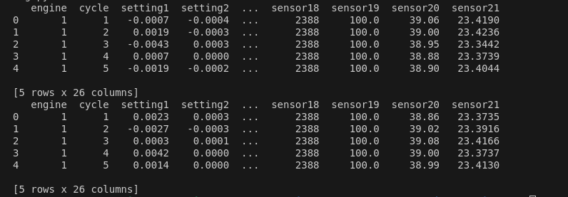
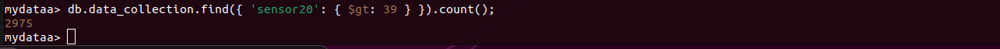

# Predictive Maintenance Model using Spark MLlib

## Overview

This project aims to develop a predictive maintenance model using Spark MLlib for analyzing sensor data stored in MongoDB.

 The focus is on detecting equipment failures before they occur by leveraging historical sensor data.

## Project Structure

```
predictive_maintenance_spark_mlib_mongodb/
│
├── data_preprocessing_scripts/
│   └── preprocessing.py        # Script for data preprocessing
│
├── imgs/                       # Directory for images
│
├── preprocessed_data/          # Directory for processed datasets
│   ├── test_processed.csv
│   └── train_processed.csv
│
├── raw_data/                   # Directory for raw sensor data
│   ├── test_sensor001.txt
│   └── train_sensor001.txt
│
└── predictive_maintenance_spark_mlib_mongodb.ipynb  # Databricks  
```

## Requirements

- Python 3.x
- Pandas
- Spark
- MongoDB
- Databricks (for running Spark MLlib)

## Installation

1. **Clone the repository**:
   ```bash
   git clone <repository-url>
   cd predictive_maintenance_spark_mlib_mongodb
   ```

2. **Install the necessary packages**:
   ```bash
   pip install pandas
   ```

3. **Set up MongoDB**:
   Make sure you have MongoDB running and accessible. You can use Docker to run MongoDB:
   ```bash
   docker run --name mymongo -d mongo
   ```

4. **Upload raw data**:
   Use the `mongoimport` command to upload your raw sensor data to MongoDB.

## Data Preprocessing

The `preprocessing.py` script handles the following steps:

1. **Loading data**: Load training and test datasets from specified file paths.
2. **Assigning column names**: Ensure datasets have appropriate column names.
3. **Handling missing values**: Drop or fill missing values based on the chosen strategy.
4. **Dropping unnecessary columns**: Remove specified columns that are not required for analysis.
5. **Saving processed data**: Save the processed datasets to CSV files for further analysis.

### Usage

To run the preprocessing script, execute:

```bash
python data_preprocessing_scripts/preprocessing.py
```
Make sure to update the file paths and column names in the script as needed.




## Model Development

Once the data is preprocessed, you can use the Jupyter Notebook (`predictive_maintenance_spark_mlib_mongodb.ipynb`) to:

- Load the processed data.
- Train predictive maintenance models using Spark MLlib (e.g., Random Forest, Gradient Boosted Trees).
- Split the data into training and testing sets for model evaluation.

## Data Quality Concerns

While developing the predictive maintenance model, consider the following data quality aspects:
- **Data Size**: The dataset used in this project is relatively small. The project serves as a proof of concept, and further exploration of larger datasets is recommended for more robust model performance.
- **Missing Values**: Ensure that the handling method for missing values aligns with the analysis goals.
- **Outliers**: Implement methods to identify and manage outliers effectively.

# Storing Data in MongoDB

The sensor data for this project is stored in MongoDB, a NoSQL database that offers several advantages for handling large volumes of unstructured or semi-structured data.

1. **Copying Data to MongoDB Container**: 
   I started by copying the sensor data files from my local machine into the MongoDB container using the following command:
   ```bash
   docker cp /home/codsalah/Downloads/train_sensor001.csv 516e2b5b8e54:/train_sensor001.csv
   ```
   This ensured that the sensor data was accessible within the container for further processing.


2. **Importing Data into MongoDB**: 
   After copying the data, I imported it into the MongoDB database using the `mongoimport` command. This command was executed inside the container to load the sensor data into a specified database and collection:
   ```bash
   mongoimport --db mydata --collection data_collection --file /train_sensor001.csv --type csv --headerline
   ```
   This command successfully imported the data, allowing for efficient querying and analysis.


3. **Exploring Data Quality**: 
   Once the data was imported, I used MongoDB queries to explore the data quality. 

Check for Missing Values

o count how many times sensor1 readings exceed 39:


4. **Generating Insights**: 
   With the data imported and understood, I performed queries to extract meaningful insights. 

Overall, using the MongoDB container facilitated a smooth workflow for managing and analyzing sensor data.


